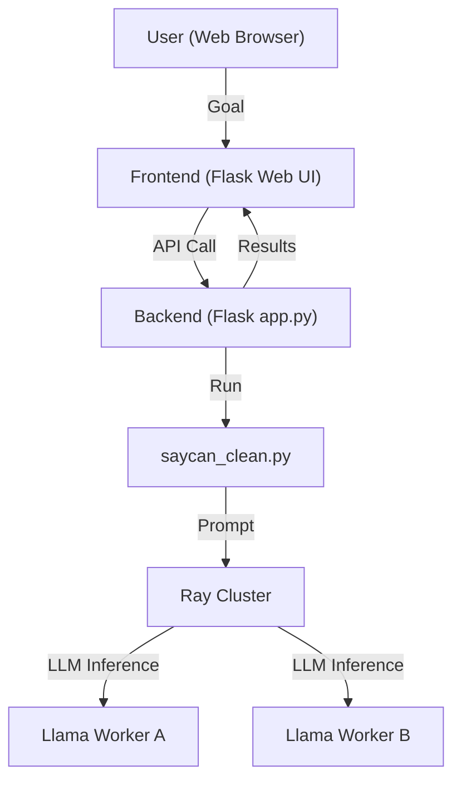

# Distributed SayCan with Llama 3.1 (8B) and Ray

A futuristic, distributed robot planning demo that combines the SayCan framework with Llama 3.1 (8B Instruct) using Ray for scalable inference. Features a modern web frontend for interactive goal input and plan visualization.

---

## 🚀 What is this?
This project demonstrates **distributed, scalable robot planning** using:
- **SayCan**: A language-model-based planning framework for robots
- **Llama 3.1 8B Instruct**: Large Language Model for plan generation
- **Ray**: Distributed computing for scalable LLM inference
- **Modern Web UI**: Glassmorphism/iridescent frontend for easy demoing

You enter a goal (e.g., "Bring me a glass of water"), and the system:
1. Uses distributed Llama workers to generate a 5-step plan
2. Shows a basic action analysis table
3. Visualizes everything in a beautiful web interface

---

## 🏗️ Architecture Overview



---

## ⚡️ Quickstart

### 1. Clone & Setup
```sh
git clone <your-repo-url>
cd Distributed-Inference---SayCan
python3 -m venv ../.venv
source ../.venv/bin/activate
pip install -r requirements.txt
```

### 2. Start Ray Head Node
```sh
ray start --head --port=6379
```

### 3. Start Llama Workers (in two terminals)
```sh
python "Distributed Inference/Ray Distributed/llama_worker_a.py"
python "Distributed Inference/Ray Distributed/llama_worker_b.py"
```

### 4. Start the Backend (Flask)
```sh
python frontend/app.py --port 5002
```

### 5. Open the Frontend
Go to [http://localhost:5002](http://localhost:5002) in your browser.

---

## 🕹️ Usage
- Enter a robot goal in the web UI
- Click "Run SayCan Planning"
- See the LLM-generated 5-step plan and action analysis

---

## 🧩 Project Structure
- `Distributed Inference/Ray Distributed/` — Llama workers, Ray client, model config
- `frontend/` — Flask backend and web UI
- `scripts/` — Convenience scripts for running components
- `saycan_clean.py` — Main SayCan planner (calls LLM via Ray)
- `requirements.txt` — Python dependencies

---

## 🛠️ Convenience Scripts
The `scripts/` directory contains helpful scripts:
- `run_frontend.sh` — Start the web frontend
- `run_saycan_clean.sh` — Run SayCan planning directly

---

## 🙏 Credits & Requirements
- Based on Google SayCan, Meta Llama 3.1, and Ray
- Requires Python 3.11+, Ray, Flask, and Llama model weights (not included)

---

## 📸 Example
 <!-- Add a screenshot if you want! -->

---

## License
MIT (or your preferred license) 